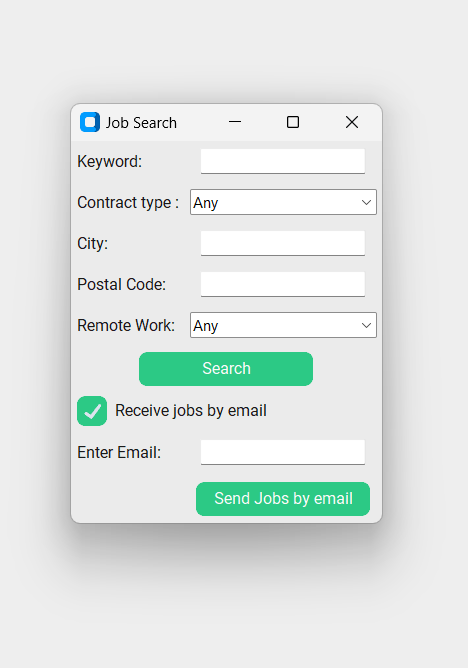

# Problem
This project is a modest attempt at replicating how job posting websites work. 
Users will interact with a constructed interface to find jobs matching their pre-defined criterias, allowing them to apply for selected jobs directly from the companies websites. Furthermore, users can choose to have their job-matching criterias directly sent to their email adresses. 

Among the criterias a user can choose from:
- **Keyword** : this can relate to job titles, or the company's name.

- **Contract type** : users can choose between a 'CDI', 'CDD', 'Stage', 'Alternance', 'Contrat d'apprentissage' or 'independant/freelance' job.

- **City and Postal Code** 

- **Remote work** : users can choose between completely remote jobs, to jobs allowing only partial or occasional remote work. 

We use ***Selenium*** to scrape job postings from the Indeed website, and ***Tkinter*** (along with ***customtkinter***) to build an easy-to-use interface.  

Below is a snippet of the interface. Users can choose to receive the job offers by mail by clicking on the checkbox, then saving the criteria selected. 

        

# Next Step
